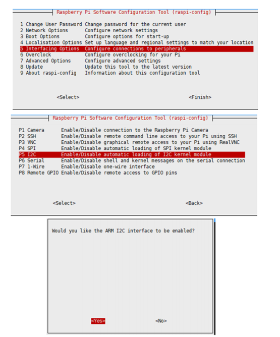
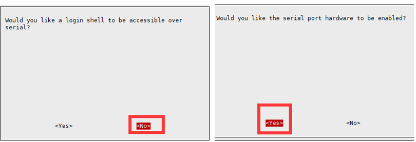

# Air Monitoring HAT

SB Components developed the Air Monitor HAT for Raspberry Pi an open-source portable sensor that has the ability to provide the level of quantity of the suspended particulates with their mass.

Buy it from : https://shop.sb-components.co.uk/products/air-monitoring-hat-for-raspberry-pi


## Pinout (Internally connected via header)

| Peripheral Pins  | Raspberry Pi Pins |
| ---------------- | ----------------- |
| 5V     	| 5V       |
| GND     	| GND      |
| PMS RX    | GPIO14   |
| PMS TX    | GPIO15   |
| PMS SET   | GPIO27   |
| PMS RESET | GPIO17   |
| Oled SDA  | GPIO2    |
| Oled SCL  | GPIO3    |


### Enable I2C and Serial Interface

 Open a terminal and run the following commands to enable I2C and Serial：


* ``` sudo raspi-config ```

Choose Interfacing Options -> I2C ->yes 




* ``` sudo raspi-config ```

Choose Interfacing Options -> Serial -> No -> Yes



## Testing

### Clone Repository

``` git clone https://github.com/sbcshop/Air-Monitoring-HAT.git ```

``` cd Air-Monitoring-HAT ```

Run GUI by running below command:

``` python3 Air_monitoring_GUI.py ```

Select <b>COM port</b> from above GUI ("/dev/ttyS0" in case of default connection), 
and click on the start button to start Real-Time data from the sensor.

You can also use these two examples and modify it easily :

 1.) display_on_oled_example.py  :- To print the sensor data on Oled Display.
 
 2.) read_example.py : To print the sensor data on Python shell or Terminal.
 
 For detailed information please visit wiki of this repository.
 
 https://github.com/sbcshop/Air-Monitoring-HAT/wiki/Wiki


